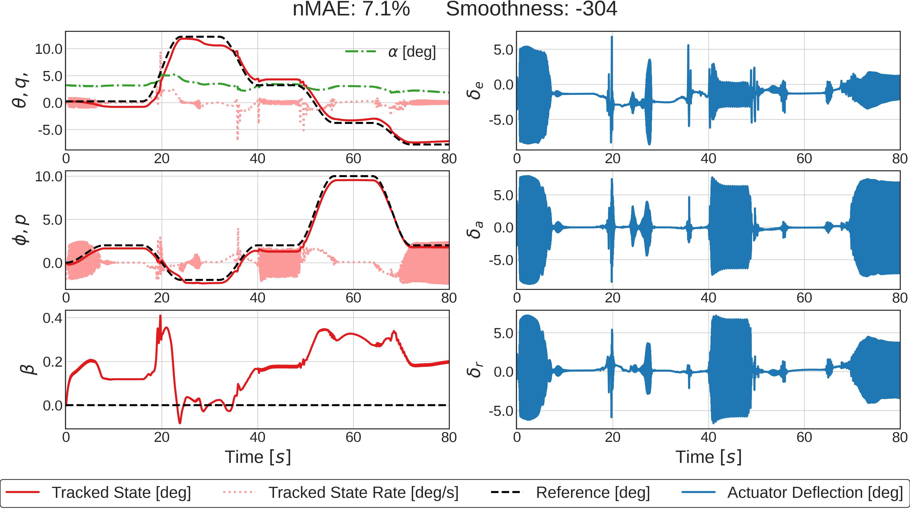

# Evolutionary Reinforcement Learning: A Hybrid Approach in Intelligent Fault-tolerant Flight Control Systems


[]()
[]()

Authors: [Vlad Gavra](https://github.com/CasperTeirlinck) &nbsp; [](https://www.linkedin.com/in/vlad-gavra-home/)


This repository contains the source code used to develop the **SERL** framework which combines TD3 and a genetic algorithm.

The environment wraps the **DASMAT** framework which h provides a high-fidelity non-linear model of a fixed-wing aircraft. It has been validated by fligh-testing using the PH-LAB (Cessna Citation II) research aircraft jointly owned between the TU Delft Faculty of Aerospace Engineering and Netherlands Aerospace Centre (NLR).


## Paper Abstract
Recent research in bio-inspired artificial intelligence potentially provides solutions to the challenging problem of designing fault-tolerant and robust flight control systems. The current work proposes SERL, a novel Safety-informed Evolutionary Reinforcement Learning algorithm, which combines Deep Reinforcement Learning (DRL) and neuro-evolutionary mechanisms. This hybrid method optimises a diverse population of non-linear control policies through both evolutionary mechanisms and gradient-based updates. We apply it to solve the attitude tracking task on a high-fidelity non-linear fixed-wing aircraft model. Compared to a state-of-the-art DRL solution, SERL achieves better tracking performance in nine out of ten cases, remaining robust against faults, changes in initial conditions and external disturbances. Furthermore, the work shows how evolutionary mechanisms can balance performance with the smoothness of control actions, a feature relevant for bridging the gap between simulation and deployment on real flight hardware.


## Module Installation Instructions
1. Create and activate a python virtual environment in project root (optional):
   ```bash
   python3.8 -m venv venv
   ```
2. Install the cloned repo as a local module:

   For use and development:

   ```bash
   python3.8 -m pip install -r requirements.txt
   ```


## Usage
### Evaluating pre-trained agents:
- `python3.8 ./base/evaluate.py -agent_name=$AGENT_NAME$ -env=$ENV_NAME$ -save_stats`
> - available agents: SERL50, SERL10, TD3
>
> - available environment: nominal, low-q, high-q, gust, cg (CG aft-shifted), be (broken elevator), jr (jammed rudder), sa (saturated aileron), se (saturated elevator), ice (ice on wings)
>
> - which part of the agent to evaluate:
>  eval_rl /
>  eval_actor /
>  eval_pop

### Training new intelligent controllers:

- `python3.8 ./base/train.py -frames=1_000_000 -should_log`


## Samples
Here are 80s time-traces of the aircraft states and computed control signals (elevaotr, aileron nd rudder deflection signals) when the palnt is controlled by the TD3 actor (left) and the SERL(50) champion( right). The flight conditions are H=2,000 m and V=90 m/s, corresponding to the trim setting used during training. 

<p align="center">
  
    
</p>


## Acknowledgements
The code base has been used to obtain the results of MSc thesis. During it, I researched the possibility to combine DRL and EA to train optimal fault-tolerant flight controllers. The project was completed within the Control \& Simulation group at the Aerospace Engineering faculty of TU Delft, under the supervision of Dr.ir. Erik-Jan van Kampen.

The link to Scientific Thesis: https://bit.ly/3D7mj0i


## References

- K. Dally and E.-J. Van Kampen, “Soft Actor-Critic Deep Reinforcement Learning for Fault Tolerant Flight Control”, 2021 [[paper](https://arxiv.org/abs/2202.09262)]

<!-- - T. Haarnoja, A. Zhou, P. Abbeel, and S. Levine, “Soft Actor-Critic: Off-Policy Maximum Entropy Deep Reinforcement Learning with a Stochastic Actor” [[paper](http://arxiv.org/abs/1801.01290)] -->

- S. Fujimoto, H. van Hoof, D. Meger, "Addressing Function Approximation Error in Actor-Critic Methods", 2018 [[paper]([https:arXiv:1802.09477](https://arxiv.org/abs/1802.09477))]


- C. Bodnar, B. Day, P. Lio, "Proximal distilled evolutionary reinforcement learning", Proceedings of the AAAI Conference on Artificial Intelligence, 2020 [[paper]((arxiv.org/abs/1906.09807))]
